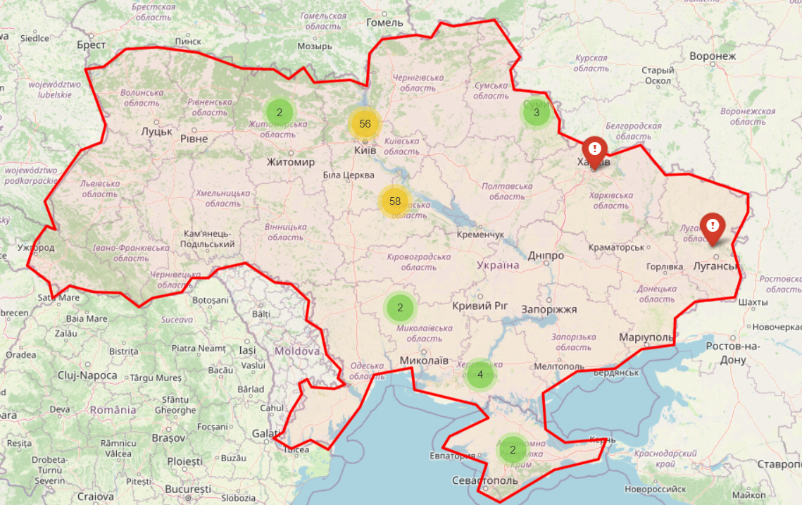

<div id="top"></div>

[![Contributors][contributors-shield]][contributors-url]
[![Forks][forks-shield]][forks-url]
[![Stargazers][stars-shield]][stars-url]
[![Issues][issues-shield]][issues-url]
[![LinkedIn][linkedin-shield]][linkedin-url]


<!-- PROJECT LOGO -->
<br />
<div align="center">
  <a href="https://github.com/kinshukdua/LiveActionMap">
    
  </a>

  <h2 align="center"> Live Action Map (LAM) </h2>

  <p align="center">
    An attempt to use open source data on Twitter to map areas with active conflict. Right now it is used for the Ukraine-Russia conflict, but in the future I hope it can be used for all sorts of dangerous situations.
    <br />
    <a href="https://github.com/kinshukdua/LiveActionMap/issues">Report Bug</a>
    ·
    <a href="https://github.com/kinshukdua/LiveActionMap/pulls">Add Feature</a>
    ·
    <a href="https://live-action-map.com/">Website Live!</a>
    ·
    <a href="https://discord.gg/F8qJXSJj6S">Join Discord!</a>
  </p>
</div>


<!-- TABLE OF CONTENTS -->
<details>
  <summary>Table of Contents</summary>
  <ol>
    <li>
      <a href="#about-the-project">About The Project</a>
    </li>
    <li>
      <a href="#getting-started">Getting Started</a>
      <ul>
        <li><a href="#prerequisites">Prerequisites</a></li>
        <li><a href="#installation">Installation</a></li>
      </ul>
    </li>
    <li><a href="#usage">Usage</a></li>
    <li><a href="#roadmap">Roadmap</a></li>
    <li><a href="#contributing">Contributing</a></li>
    <li><a href="#license">License</a></li>
  </ol>
</details>


<!-- ABOUT THE PROJECT -->
## About The Project
There are many twitter accounts posting live tweets about locations with conflicts. However, it is difficult to keep track of the locations especially with multiple different sources pointing out different location every few minutes. To make sure people can stay safe and take care of themselves, I have aggregated all the tweets into a single map that is easily accessible.

This project is a work in progress. I am working on adding more features and improving the map.

<a href="https://live-action-map.com/"></a>


How it works:
 * Tweets are sourced using keywords, hashtags and prepositions, such as the phrase "shooting... near ... location".
 * Tweets can also be sourced from known twitter accounts by passing their usernames.
 * Tweets are parsed with NLP and the location is extracted from the tweet, this however is not perfect so we need to filter locations later on.
 * Some tweets might talk about other countries reactions like "The US.." or "Russia.." or "Moscow..", in that case we remove all the locations that are not in Ukraine.
 * Some tweets might talk about multiple locations like "Shooting near the location and the location". In that case both locations are added to the map.  Multiple markers can be added to the same location.
 * Finally we add markers for each tweet. 
 * Markers will cluster together when you zoom out.
 * A single marker looks like a red pin on a map.
 * A cluster appears as a circle with a number inside it, the color shifts from green to orange to red depending on the number of markers in the cluster.
 * We are not taking data directly because that may be vulnerable to trolling and spamming.
 * We are using the Twitter v2 API to get the tweets, however it does not support parsing location directly from tweets.

<p align="right">(<a href="#top">back to top</a>)</p>


<!-- GETTING STARTED -->
## Getting Started

To get a local copy up and running follow these simple example steps.

### Prerequisites
* Python
* tweepy
* spaCy
* folium
* geopy
* tqdm
* geography3 (optional, needed for experimental feature)


### Installation

#### Python

<div id="twitter-token"></div>

1. Get a free twitter Bearer Token from [developer.twitter.com](https://developer.twitter.com/en/docs/twitter-api/getting-started/getting-access-to-the-twitter-api). Remember to create a new app and get the bearer token.
2. Clone the repo
   ```sh
   git clone https://github.com/kinshukdua/LiveActionMap.git
   ```
3. Install all prerequisites
   ```sh
   pip install -r requirements.txt
   ```
4. Download en_core_web, for more info see --> https://github.com/explosion/spaCy/issues/4577
   ```sh
    python3 -m spacy download en_core_web_sm
   ```
5. Create a `.env` file based on the `.env.example`
   ```sh
   cp .env.example .env
   ```
6. Set the Twitter bearer token to your own in the `.env` file created in the previous step.

#### Docker

1. [Get a Twitter Bearer Token](#twitter-token)
1. Download the `docker-compose.yaml`-file
    ```sh
    wget https://raw.githubusercontent.com/kinshukdua/LiveActionMap/main/docker/docker-compose.yaml
    ```
1. Create a `.env` file based on the .env.example
    ```sh
    wget https://raw.githubusercontent.com/kinshukdua/LiveActionMap/main/.env.example -O .env 
    ```
1. Start the stack
    ```
    docker-compose up -d
    ```

<p align="right">(<a href="#top">back to top</a>)</p>


<!-- USAGE EXAMPLES -->
## Usage

Simply edit hashtags, prepositions and keywords and run scrape.py.

   ```python
   python scrape.py
   ```
<p align="right">(<a href="#top">back to top</a>)</p>


<!-- ROADMAP -->
## Roadmap

- [x] Add tweet scraping
- [x] Add map
- [x] Add map clustering
- [x] Create a server to host the generated map
- [ ] Add better filtering
- [x] Add tweet link on map
- [ ] Use NLP to indicate danger level
- [ ] Add misinformation prevention algorithm
- [ ] Multi-language Support
    - [ ] Ukranian
    - [ ] Russian

See the [open issues](https://github.com/kinshukdua/LiveActionMap/issues) for a full list of proposed features (and known issues).

<p align="right">(<a href="#top">back to top</a>)</p>


<!-- CONTRIBUTING -->
## Contributing

Contributions are what make the open source community such an amazing place to learn, inspire, and create. Any contributions you make are **greatly appreciated**.

If you have a suggestion that would make this better, please fork the repo and create a pull request. You can also simply open an issue with the tag "enhancement".
Don't forget to give the project a star! Thanks again!

1. Fork the Project
2. Create your Feature Branch (`git checkout -b feature/AmazingFeature`)
3. Commit your Changes (`git commit -m 'Add some AmazingFeature'`)
4. Push to the Branch (`git push origin feature/AmazingFeature`)
5. Open a Pull Request

<p align="right">(<a href="#top">back to top</a>)</p>


<!-- LICENSE -->
## License

Distributed under the MIT License. See `LICENSE.txt` for more information.

<p align="right">(<a href="#top">back to top</a>)</p>

<!-- MARKDOWN LINKS & IMAGES -->
<!-- https://www.markdownguide.org/basic-syntax/#reference-style-links -->
[contributors-shield]: https://img.shields.io/github/contributors/kinshukdua/LiveActionMap.svg?style=for-the-badge
[contributors-url]: https://github.com/kinshukdua/LiveActionMap/graphs/contributors
[forks-shield]: https://img.shields.io/github/forks/kinshukdua/LiveActionMap.svg?style=for-the-badge
[forks-url]: https://github.com/kinshukdua/LiveActionMap/network/members
[stars-shield]: https://img.shields.io/github/stars/kinshukdua/LiveActionMap.svg?style=for-the-badge
[stars-url]: https://github.com/kinshukdua/LiveActionMap/stargazers
[issues-shield]: https://img.shields.io/github/issues/kinshukdua/LiveActionMap.svg?style=for-the-badge
[issues-url]: https://github.com/kinshukdua/LiveActionMap/issues
[linkedin-shield]: https://img.shields.io/badge/-LinkedIn-black.svg?style=for-the-badge&logo=linkedin&colorB=555
[linkedin-url]: https://linkedin.com/in/dua
[product-screenshot]: images/screenshot.png
